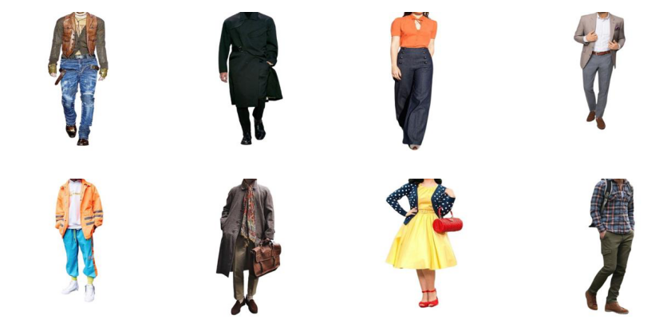

# 
 **기초인공지능 PROJECT \#7** 

### 
 **2016142209 김태윤** 

**목차**

[**1. Data**](#1-data)
   1. More data
   2. Preprocess
   3. Augmentation
   
[**2. Model**](#2-model)
   1. ResNet
   2. DenseNet
   3. MobileNet
   4. Ensemble
   
[**3. Ensemble**](#3-ensemble)
   1. Three different models
   2. Three DenseNet
   
[**4. Result**](#4-result)

## **1. Data**
1. More data
   
    &nbsp;&nbsp;
    이미지 분류에서 가장 중요한 것은 데이터의 양과 질이다. 또한 Pretrain된 모델에 추가로 분류할 데이터를 학습한다고 해도 추가되는 데이터의 양과 질은 보장되어야 한다. 따라서 학습을 위해 준비된 총 150장의 이미지 데이터는 충분한 양의 데이터가 되지못한다. 모델의 성능을 조금이라도 올리기 위해서 추가적인 데이터가 필요하다고 생각됐고, 150여 장의 이미지 데이터를 더 추가하여 총 306장의 이미지, class 별로는 formal: 98장, hiphop: 98장, vintage: 110장의 이미지를 학습에 이용했다.
     
     

2. Preprocess
   
   &nbsp;&nbsp;
   수집된 패션 이미지 데이터에는 우리가 원하는 정보 (옷에 대한 정보) 외에도 학습에 필요없는 노이즈 정보 (배경에 대한 정보) 가 포함되어있다. 모델에 노이즈도 같이 학습하여 모델이 노이즈를 판단할 수 있도록 할수도 있지만, 임의로 학습전 노이즈를 제거하여 모델의 성능을 더 높일 수 있을 것이라고 생각했다. 따라서 ["removebg"](https://www.remove.bg/)에서 이미지의 배경 정보를 모두 지웠으며, 배경이 제거된 이미지의 예시는 아래와 같다.
     
   
     
3. Augmentation
    
    &nbsp;&nbsp;
    이미지 데이터가 적기 때문에 추가로 이미지를 수집해 줬지만, 그럼에도 불구하고 높은 정확도의 성능을 보여주기 위해서는 이미지 데이터의 양이 부족하다고 생각됐기 때문에 Augmentation을 이용해서 데이터의 양을 늘려보려고 했다. 우리가 수집한 데이터에 맞는 기법을 추려보니 "Horizontalflip" 과 "Crop" 을 사용하면 이미지에서 우리가 원하는 정보를 크게 훼손하지 않고 Augmentation을 할 수 있을 것이란 생각이 들었다. 따라서 각각의 기법에 대해서 모델의 성능에 어떤 영향을 주는지 확인해 봤다.
     
    &nbsp;&nbsp;
    아래는 ResNet50 모델에서 파라미터 값 learning rate = 0.00001, epoch = 150 의 상황에서 각 기법 별 성능을 나타낸 것이다.
     
    |제목|1st|2nd|3rd|4th|5th|6th|7th|8th|9th|10th|avg|
    |-----|---|---|---|---|---|---|---|---|---|---|---|
    |Normal|0.79|0.89|0.87|0.84|0.87|0.85|0.84|0.82|0.84|0.87|0.85|
    |HorizontalFlip(0.5)|0.79|0.80|0.75|0.84|0.80|0.80|0.90|0.85|0.85|0.93|0.83|
    |Crop(224)|0.89|0.85|0.77|0.82|0.93|0.79|0.93|0.85|0.85|0.82|0.85|
    |Flip(0.5)+Crop(224)|0.84|0.82|0.85|0.77|0.85|0.82|0.77|0.77|0.85|0.77|0.81|
    
     

## **2. Model**
1. ResNet
2. DenseNet
3. MobileNet
4. Ensemble

## **3. Ensemble**
1. Three different Models
2. Three DenseNet

## **4. Result**