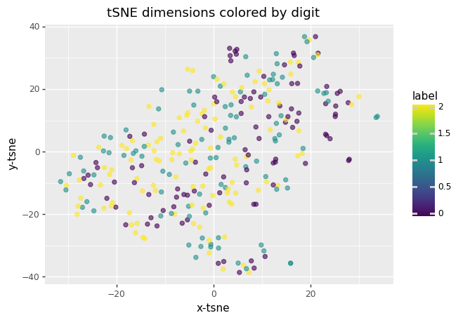
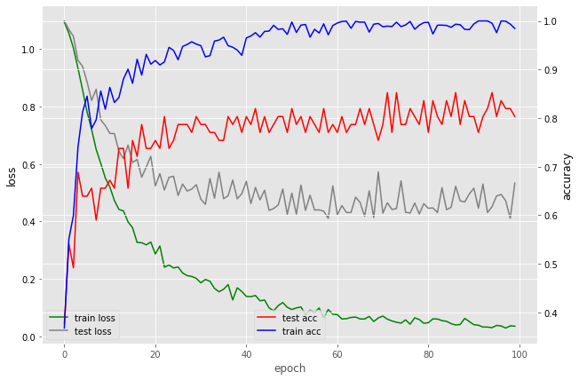
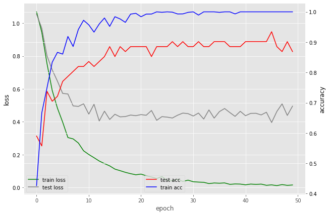
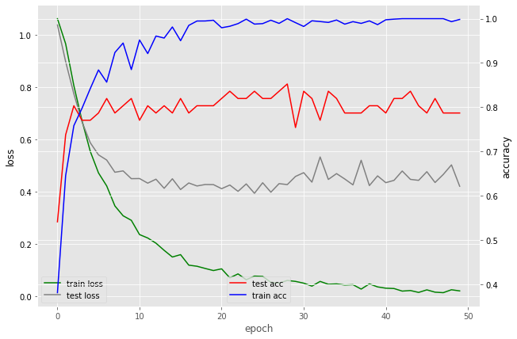
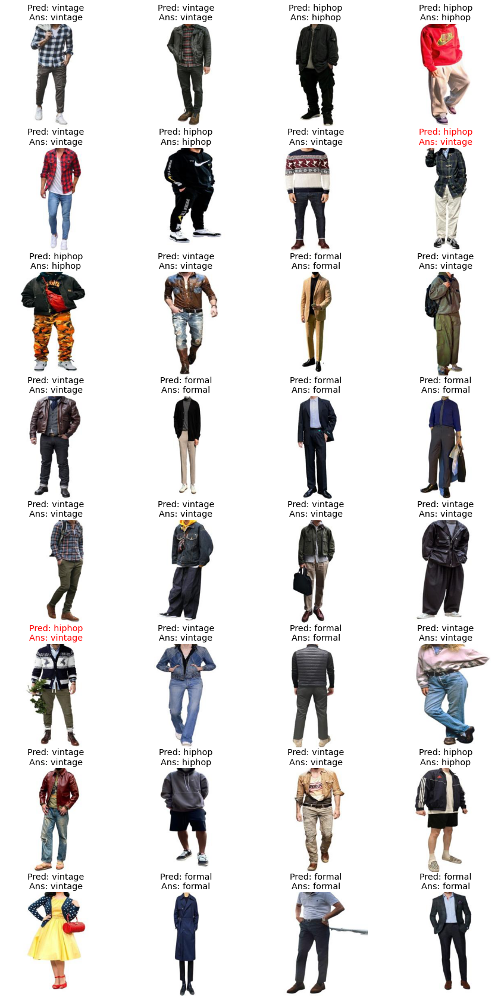
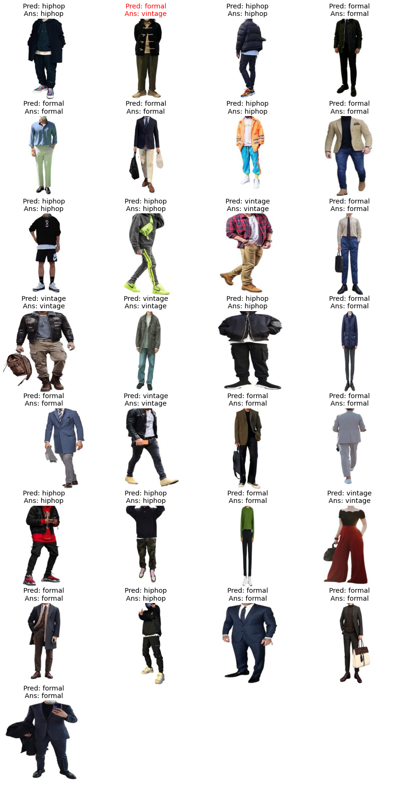

# 
 **기초인공지능 PROJECT \#7** 

### 
 **2016142209 김태윤** 

**목차**

[**1. Data**](#1-data)
   
   1. [More data](#1-more-data) 
   2. [Preprocess](#2-preprocess) 
   3. [Augmentation](#3-augmentation) 
   4. [TSNE](#4-tsne)
   
[**2. Model**](#2-model)

   1. [ResNet](#1-resnet) 
   2. [DenseNet](#2-densenet) 
   3. [MobileNet](#3-mobilenet) 
   4. [Ensemble](#4-ensemble)
   
[**3. Ensemble**](#3-ensemble)
   1. [Three different models](#1-three-different-models) 
   2. [Three DenseNet](#2-three-densenet)
   
[**4. Result**](#4-result)

## **1. Data**
### **1. More data**
   
   &nbsp;&nbsp;
   이미지 분류에서 가장 중요한 것은 데이터의 양과 질이다. 또한 Pretrain된 모델에 추가로 분류할 데이터를 학습한다고 해도 추가되는 데이터의 양과 질은 보장되어야 한다. 따라서 학습을 위해 준비된 총 150장의 이미지 데이터는 충분한 양의 데이터가 되지못한다. 모델의 성능을 조금이라도 올리기 위해서 추가적인 데이터가 필요하다고 생각됐고, 150여 장의 이미지 데이터를 더 추가하여 **총 306장**의 이미지, Class 별로는 **formal: 98장, hiphop: 98장, vintage: 110장**의 이미지를 학습에 이용했다.

### **2. Preprocess**
   
   &nbsp;&nbsp;
   수집된 패션 이미지 데이터에는 우리가 원하는 정보 (옷에 대한 정보) 외에도 학습에 필요없는 노이즈 정보 (배경에 대한 정보) 가 포함되어있다. 모델에 노이즈도 같이 학습하여 모델이 노이즈를 판단할 수 있도록 할수도 있지만, 임의로 학습전 노이즈를 제거하여 모델의 성능을 더 높일 수 있을 것이라고 생각했다. 따라서 ["removebg"](https://www.remove.bg/)에서 이미지의 배경 정보를 모두 지웠으며, 배경이 제거된 이미지의 예시는 아래와 같다.
     
   

### **3. Augmentation**
    
   &nbsp;&nbsp;
   이미지 데이터가 적기 때문에 추가로 이미지를 수집해 줬지만, 그럼에도 불구하고 높은 정확도의 성능을 보여주기 위해서는 이미지 데이터의 양이 부족하다고 생각됐기 때문에 Augmentation을 이용해서 데이터의 양을 늘려보려고 했다. 우리가 수집한 데이터에 맞는 기법을 추려보니 **"Random Horizontal flip"** 과 **"Random Crop"** 을 사용하면 이미지에서 우리가 원하는 정보를 크게 훼손하지 않고 Augmentation을 할 수 있을 것이란 생각이 들었다. 따라서 각각의 기법에 대해서 모델의 성능에 어떤 영향을 주는지 확인해 봤다.
     
   &nbsp;&nbsp;
   아래는 ResNet50 모델에서 파라미터 값 **learning rate = 0.00001, epoch = 150** 의 상황에서 **학습하는동안 보여준 최고 Test accuracy**를 각 기법 별 성능을 나타낸 것이다.
    
   |-|1st|2nd|3rd|4th|5th|6th|7th|8th|9th|10th|avg|
   |-----|---|---|---|---|---|---|---|---|---|---|---|
   |Normal|0.79|0.89|0.87|0.84|0.87|0.85|0.84|0.82|0.84|0.87|0.85|
   |HorizontalFlip(0.5)|0.79|0.80|0.75|0.84|0.80|0.80|0.90|0.85|0.85|0.93|0.83|
   |Crop(224)|0.89|0.85|0.77|0.82|0.93|0.79|0.93|0.85|0.85|0.82|0.85|
   |Flip(0.5)+Crop(224)|0.84|0.82|0.85|0.77|0.85|0.82|0.77|0.77|0.85|0.77|0.81|

   &nbsp;&nbsp;
   각 기법 별로 성능을 평가해본 결과, 예상과는 달리 Augmentation을 한 경우와 하지 않은 경우에 성능에서 큰 차이를 보여주지 못했다. 또한 50% 확률로 HorizontalFlip을 한 경우와 HorizontalFlip과 Crop을 같이한 경우에는 오히려 성능이 떨어지는 결과를 나타냈다. 이 결과를 바탕으로 이후 사용되는 **Augmentation은 224x224 사이즈 RandomCrop만 사용했다.** 
     
   &nbsp;&nbsp;
   사용된 코드는 아래와 같다.   
   ~~~python
   train_transforms = transforms.Compose([transforms.Resize(img_size),
                              transforms.RandomCrop(224),
                              transforms.ToTensor(),
                              ])
   test_transforms = transforms.Compose([transforms.Resize(img_size),
                                 transforms.ToTensor(),
                                 ])
   ~~~

### **4. TSNE**
   
   &nbsp;&nbsp;
   TSNE는 고차원 데이터를 데이터의 특징을 살린 저차원의 데이터로 바꿔 시각화 할 수 있도록 해주는 알고리즘이다. 이 알고리즘을 이용해서 수집된 패션 이미지를 시각화한 결과는 아래와 같다.
   

   &nbsp;&nbsp;
   시각화 결과 각 라벨별로 군집이 제대로 생기는 것은 관찰되지 않았다. 학습 이미지를 수집하고 라벨링하는 과정에서 인간의 주관적인 판단이 개입되어서 라벨별 특징이 잘 잡히지 않았거나, 3x256x256 개의 features를 가지는 이미지이므로 너무 feature 수가 많아서 군집이 형성되지 않은 것 같다.
     
   &nbsp;&nbsp;
   위 시각화를 위해서 사용된 코드는 아래와 같다. 이 때 사용된 이미지에 Augmentation은 사용하지 않았다.
   ~~~python
   # TSNE Modeling
   from sklearn.manifold import TSNE
   import pandas as pd
   from plotnine import *

   first = 1
   for x_data, y_data in testloader:
   if (first == 1):
      x = x_data
      y = y_data
      first = 0
   else:  
      x = torch.cat((x,x_data), dim=0)
      y = torch.cat((y,y_data), dim=0)
   
   for x_data, y_data in trainloader:
   x = torch.cat((x,x_data), dim=0)
   y = torch.cat((y,y_data), dim=0)

   x = x.flatten(start_dim=1, end_dim=-1)
   y = y.unsqueeze(1)
   t = torch.cat((x,y), dim=1)
   t = t.numpy()

   df = pd.DataFrame(t)
   df.rename(columns = {196608: "label"}, inplace=True)

   tsne = TSNE(n_components=2, verbose=1, perplexity=10, learning_rate=20, n_iter=1000)
   tsne_result = tsne.fit_transform(x)

   df_tsne = df.copy()
   df_tsne['x-tsne'] = tsne_result[:,0] 
   df_tsne['y-tsne'] = tsne_result[:,1] 
   chart = ggplot( df_tsne, aes(x='x-tsne', y='y-tsne', color='label') ) \
         + geom_point(size=2, alpha=0.6) \
         + ggtitle("tSNE dimensions colored by digit") 

   print(chart)
   ~~~

## **2. Model**
### **1. ResNet**

   &nbsp;&nbsp;
   이미지 분류를 위해서 먼저 ResNet을 사용했으며, pytorch에서 제공되는 ResNet50 모델에 Fully Connected layer를 추가하여 사용하였다. Pretrain된 모델을 사용하였기 때문에 준비된 이미지로 학습을 시킬 때에는 finetuning을 하지 않고 FC layer의 파라미터만 학습시켰다.
     
   &nbsp;&nbsp;
   사용된 코드는 아래와 같다.
   ~~~python
   class Res(nn.Module):
      def __init__(self, num_cls = 3, pretrain=True, finetuning=True):
         super().__init__()
         self.model = models.resnet50(pretrained=pretrain)
         self.finetuning = finetuning
         if finetuning == False:
            for param in self.model.parameters():
                  param.requires_grad = False
         fc = []
         fc += [nn.Linear(self.model.fc.in_features, 512)]
         fc += [nn.ReLU()]
         fc += [nn.Linear(512, 128)]
         fc += [nn.ReLU()]
         fc += [nn.Linear(128, num_cls)]
         fc += [nn.LogSoftmax(dim=1)]
         self.model.fc = nn.Sequential(*fc)

      def forward(self, x):
         out = self.model.forward(x)
         return out

      def get_prams(self):
         if self.finetuning:
            return list(self.model.parameters()) + list(self.fc.parameters())
         else:
            return self.model.fc.parameters()
   ~~~

   &nbsp;&nbsp;
   또한 학습할 이미지에 대한 ResNet의 적절한 learning rate 를 찾기 위해서 **learning rate가 0.00001일 때와 0.0001일 때** 모델의 성능을 비교해 보았다. 결과는 아래와 같다.
    

   |-|1st|2nd|3rd|4th|5th|6th|7th|8th|9th|10th|AVG|STD|
   |-----|---|---|---|---|---|---|---|---|---|---|---|---|
   |lr = 1E-5, epoch = 150|0.75|0.80|0.84|0.85|0.85|0.79|0.89|0.80|0.79|0.87|0.82|0.042|
   |lr = 1E-4, epoch = 100|0.89|0.77|0.82|0.82|0.92|0.82|0.80|0.79|0.82|0.75|0.82|0.049|
   
   &nbsp;&nbsp;
    각 learning rate 별로 성능을 평가해본 결과 정확도와 표준편차에서 **의미있는 성능 차이를 나타내지 못했다.** 따라서 **ResNet에 대해서**는  학습시간을 줄이기 위해서 epoch를 줄여도 일정 성능 이상을 보여주는 **learing rate = 0.0001을 사용**했다.
      
    &nbsp;&nbsp;
    ResNet의 **train graph**는 아래와 같다.
      
    

### **2. DenseNet**
   
   &nbsp;&nbsp;
   ResNet을 이용해서 이미지 분류를 해본 결과 성능이 만족할만한 수준이 나오지 않아서 다른 모델을 이용해서 이미지 분류를 하려고 다른 모델을 테스트 해봤다. 그 중에서 DenseNet161을 이용한 결과 상대적으로 좋은 성능을 보여줬다.
    

   &nbsp;&nbsp;
   DenseNet은 pytorch에 제공되는 Pretrain된 DenseNet 모델에 ResNet과 마찬가지로 Fully Connected layer를 추가하고 FC만 학습하였다.
     

   &nbsp;&nbsp;
   사용된 코드는 아래와 같다.
   ~~~python
   class Dense(nn.Module):
      def __init__(self, num_cls = 3, pretrain=True, finetuning=True):
         super().__init__()
         self.model = models.densenet161(pretrained=pretrain)
         self.finetuning = finetuning
         if finetuning == False:
            for param in self.model.parameters():
                  param.requires_grad = False
         fc = []
         fc += [nn.Linear(1000, 512)]
         fc += [nn.ReLU()]
         fc += [nn.Linear(512, 128)]
         fc += [nn.ReLU()]
         fc += [nn.Linear(128, num_cls)]
         fc += [nn.LogSoftmax(dim=1)]
         self.model.fc = nn.Sequential(*fc)

      def forward(self, x):
         x = self.model(x)
         out = self.model.fc(x)
         return out

      def get_prams(self):
         if self.finetuning:
            return list(self.model.parameters()) + list(self.fc.parameters())
         else:
            return self.model.fc.parameters()
   ~~~
   &nbsp;&nbsp;
   또한 학습할 이미지에 대한 DenseNet의 적절한 learning rate 를 찾기 위해서 **learning rate가 0.00001일 때와 0.0001일 때** 모델의 성능을 비교해 보았다. 결과는 아래와 같다.
    

   |-|1st|2nd|3rd|4th|5th|6th|7th|8th|9th|10th|AVG|STD|
   |-----|---|---|---|---|---|---|---|---|---|---|---|---|
   |lr = 1E-5, epoch = 100|0.89|0.90|0.80|0.80|0.87|0.92|0.90|0.92|0.87|0.92|0.88|0.044|
   |lr = 1E-4, epoch = 50|0.92|0.85|0.84|0.97|0.85|0.87|0.92|0.85|0.87|0.89|0.88|0.041|
   
   &nbsp;&nbsp;
   DenseNet도 ResNet과 마찬가지로 **lr = 0.00001과 lr = 0.0001 일 때** 정확도와 표준편차에서 **유의미한 차이가 없었다**. 따라서 **DenseNet에 대해**서는 epoch의 수를 줄여서 학습 시간을 줄일 수 있는 **lr = 0.0001을 사용**했다.
     
   &nbsp;&nbsp;
   DenseNet의 **train graph**는 아래와 같다.
     

   

### **3. MobileNet**
   
   &nbsp;&nbsp;
   ResNet과 DenseNet을 이용하여 이미지 분류를 해본결과 일정 수준 이상의 분류 정확도를 보여줬지만, 데이터셋의 크기가 너무 작고, 데이터에 라벨링을 하는 과정에서 인간의 주관적인 판단이 들어가기 때문에 각 Class별 패션 이미지의 특징을 잘 뽑아낼 수 없는 문제가 발생한다. 따라서 테스트셋에 어떠한 이미지가 들어가느냐에 따라서 모델의 정확도가 크게 변하게 된다. 즉, 정확도의 분산이 크게 되는 문제가 있다. 
    
   &nbsp;&nbsp;
   따라서 앙상블 기법을 통해서 모델 정확도의 분산을 줄이는게 효과적이라고 생각했다. 앙상블 기법을 사용하는데 이용되는 모델의 수가 많을 수록 더 효과적이기 때문에 최소한 3개 이상의 모델이 필요하다고 생각했고, 이를 위해서 **파라미터의 수가 적어 학습에 시간이 적게 걸리면서도 어느 정도 이상의 정확도 성능**을 보여주는 MobileNet을 이용하기로 했다.
    

   &nbsp;&nbsp;
   MobileNet은 pytorch에 제공되는 Pretrain된 DenseNet 모델에 다른 모델들과 마찬가지로 Fully Connected layer를 추가하고 FC만 학습하였다.
     

   &nbsp;&nbsp;
   사용된 코드는 아래와 같다.
   ~~~python
   class Mobile(nn.Module):
      def __init__(self, num_cls = 3, pretrain=True, finetuning=True):
         super().__init__()
         self.model = models.mobilenet_v2(pretrained=pretrain)
         self.finetuning = finetuning
         if finetuning == False:
               for param in self.model.parameters():
                  param.requires_grad = False
         fc = []
         fc += [nn.Linear(1000, 512)]
         fc += [nn.ReLU()]
         fc += [nn.Linear(512, 128)]
         fc += [nn.ReLU()]
         fc += [nn.Linear(128, num_cls)]
         fc += [nn.LogSoftmax(dim=1)]
         self.model.fc = nn.Sequential(*fc)

      def forward(self, x):
         x = self.model(x)
         out = self.model.fc(x)
         return out

      def get_prams(self):
         if self.finetuning:
               return list(self.model.parameters()) + list(self.fc.parameters())
         else:
               return self.model.fc.parameters()
   ~~~
   &nbsp;&nbsp;
   또한 학습할 이미지에 대한 MobileNet의 적절한 learning rate 를 찾기 위해서 **learning rate가 0.00001일 때와 0.0001일 때** 모델의 성능을 비교해 보았다. 결과는 아래와 같다.
    

   |-|1st|2nd|3rd|4th|5th|6th|7th|8th|9th|10th|AVG|STD|
   |-----|---|---|---|---|---|---|---|---|---|---|---|---|
   |lr = 1E-5, epoch = 100|0.82|0.85|0.74|0.82|0.87|0.75|0.80|0.80|0.82|0.82|0.81|0.040|
   |lr = 1E-4, epoch = 50|0.87|0.80|0.72|0.74|0.80|0.79|0.79|0.80|0.79|0.82|0.79|0.041|
   
   &nbsp;&nbsp;
   MobileNet도  **lr = 0.00001과 lr = 0.0001 일 때** 정확도와 표준편차에서 **유의미한 차이가 없었다**. 따라서 **MobileNet에 대해**서는 epoch의 수를 줄여서 학습 시간을 줄일 수 있는 **lr = 0.0001을 사용**했다.
     
   &nbsp;&nbsp;
   MobileNet의 **train graph**는 아래와 같다.
     

   

### **4. Ensemble**
   
   &nbsp;&nbsp;
   이미지 분류의 성능을 높이면서도 어떤 테스트셋으로 테스트하냐와 상관없이 꾸준한 성능을 보여주기 위해서 앙상블 기법을 사용했다. 사용된 코드는 아래와 같다.
   ~~~python
   class Ensemble(nn.Module):
      def __init__(self, model1, model2, model3):
         super().__init__()
         self.model1 = model1
         self.model2 = model2
         self.model3 = model3

      def forward(self, x):
         out1 = self.model1(x)
         out2 = self.model2(x)
         out3 = self.model3(x)

         out = (out1 + out2 + out3) / 3
         
         return out

      def get_prams(self):
         return self.model.parameters()
   ~~~
   &nbsp;&nbsp;
   앙상블 모델은 따로 학습하지 않고 학습된 3개의 모델의 아웃풋을 평균내서 결과는 내는 **soft vote 방식**을 사용했다.

## **3. Ensemble**
### **1. Three different Models**

   &nbsp;&nbsp;
   앙상블 모델을 ResNet, DenseNet, MobileNet을 이용해서 구성했을 때, 성능은 아래와 같다.
    
   |-|1st|2nd|3rd|4th|5th|6th|7th|8th|9th|10th|AVG|STD|
   |-----|---|---|---|---|---|---|---|---|---|---|---|---|
   |ResNet|0.82|0.80|0.80|0.82|0.85|0.89|0.82|0.82|0.75|0.79|0.82|0.035|
   |DenseNet|0.85|0.93|0.97|0.87|0.84|0.92|0.92|0.93|0.85|0.85|0.89|0.046|
   |MobileNet|0.82|0.87|0.84|0.85|0.80|0.85|0.85|0.84|0.74|0.75|0.82|0.044|
   |AVG|0.83|0.87|0.87|0.85|0.83|0.89|0.86|0.86|0.78|0.80|0.84|-|
   |Ensemble|0.89|0.95|0.89|0.90|0.89|0.95|0.93|0.90|0.80|0.90|0.90|0.043|

   &nbsp;&nbsp;
   3가지 다른 모델을 앙상블 했을 때, 3가지 모델 정확도의 평균보다 **6% 높은 정확도**를 보여줬고 평균 정확도가 가장 높은 DenseNet의 평균 정확도보다 높거나 비슷한 수준의 성능을 보여줬다.
    
   &nbsp;&nbsp;
   하지만 표준편차와 관련해서는 예상과는 달리 성능향상을 보여주지 못했다. 따라서 모델 성능의 분산은 테스트셋이 어떻게 정해지느냐에 크게 영향을 받는 것으로 볼 수 있다. 즉, 테스트셋이 패션 이미지의 특징을 잘 나타내지 못하게 정해지면 모든 모델의 성능이 낮아지고 그렇지 않으면 모든 모델의 성능이 높아지는 것이다. 따라서 이 문제를 해결하기 위해서는 **데이터셋의 크기가 더더욱 커질 필요성**이 있어 보인다. 
   
### **2. Three DenseNet**

   &nbsp;&nbsp;
   앙상블 모델을 이용하다보니 DenseNet의 성능이 매우 좋은 것에 비해서 다른 모델의 성능이 낮아서 DenseNet의 성능이 묻히는 것처럼 보였다. 따라서 DenseNet 3개를 앙상블하면 성능이 더 잘 나올 것이라 생각해서 테스트해봤다. 그 결과는 아래와 같다.
    
   |-|1st|2nd|3rd|4th|5th|6th|7th|8th|9th|10th|AVG|STD|
   |-----|---|---|---|---|---|---|---|---|---|---|---|---|
   |DenseNet1|0.92|0.90|0.87|0.89|0.87|0.89|0.85|0.85|0.84|0.90|0.88|0.03|
   |DenseNet2|0.93|0.89|0.87|0.92|0.89|0.87|0.89|0.84|0.87|0.89|0.88|0.03|
   |DenseNet3|0.93|0.89|0.89|0.90|0.90|0.89|0.89|0.85|0.85|0.89|0.89|0.02|
   |AVG|0.93|0.89|0.87|0.90|0.89|0.88|0.87|0.85|0.85|0.89|0.88|-|
   |Ensemble|0.93|0.90|0.89|0.89|0.87|0.89|0.90|0.85|0.85|0.89|0.89|0.02|

   &nbsp;&nbsp;
   위 결과를 봤을 때, **같은 모델 여러개를 앙상블 하더라도 성능의 향상은 나타나지 않고** 한개의 모델을 사용했을 때와 비슷한 성능을 보여줬다. 따라서 앙상블을 하는 경우에는 다른 모델을 사용하는 것이 성능향상에 도움이 되는 것을 알 수 있다. 

## **4. Result**
   
   &nbsp;&nbsp;
   테스트된 모델들 중에서 최고의 성능을 내는 모델인 **Three different model Ensemble 모델**을 이용해서 이미지 분류를 한 결과 테스트셋에 대한 **정확도 95.08%** 이고, 그 결과는 아래와 같다.
   
   